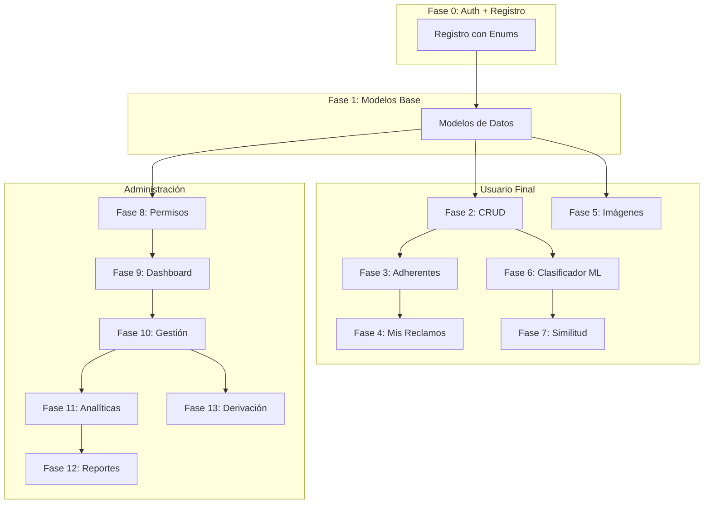

# Guía de Implementación - Sistema de Reclamos

Este documento detalla el plan de implementación paso a paso para el sistema de reclamos. Las funcionalidades están ordenadas de menor a mayor complejidad, con las dependencias claramente identificadas.

---

## Tabla de Contenidos

### Parte 0: Base del Sistema
0. [Fase 0: Registro y Autenticación de Usuarios](#fase-0-registro-y-autenticación-de-usuarios)

### Parte 1: Funcionalidades de Usuario Final
1. [Fase 1: Modelo de Datos de Reclamos](#fase-1-modelo-de-datos-de-reclamos)
2. [Fase 2: CRUD Básico de Reclamos](#fase-2-crud-básico-de-reclamos)
3. [Fase 3: Sistema de Adherentes](#fase-3-sistema-de-adherentes)
4. [Fase 4: Mis Reclamos y Notificaciones](#fase-4-mis-reclamos-y-notificaciones)
5. [Fase 5: Carga de Imágenes](#fase-5-carga-de-imágenes)
6. [Fase 6: Clasificador Automático](#fase-6-clasificador-automático)
7. [Fase 7: Detección de Reclamos Similares](#fase-7-detección-de-reclamos-similares)

### Parte 2: Funcionalidades de Administración
8. [Fase 8: Sistema de Roles y Permisos](#fase-8-sistema-de-roles-y-permisos)
9. [Fase 9: Dashboard de Departamentos](#fase-9-dashboard-de-departamentos)
10. [Fase 10: Gestión de Reclamos (Admin)](#fase-10-gestión-de-reclamos-admin)
11. [Fase 11: Analíticas y Estadísticas](#fase-11-analíticas-y-estadísticas)
12. [Fase 12: Generación de Reportes](#fase-12-generación-de-reportes)
13. [Fase 13: Derivación de Reclamos](#fase-13-derivación-de-reclamos)

---

## Fase 0: Registro y Autenticación de Usuarios

### Objetivo
Implementar dos tipos de usuarios separados usando herencia de SQLAlchemy:
- **UsuarioFinal**: Usuarios finales que crean y adhieren a reclamos (tienen claustro)
- **UsuarioAdmin**: Usuarios administrativos que gestionan reclamos (tienen departamento y rol admin)

### 0.1 Arquitectura de Herencia (Single Table Inheritance)

Se usa **Single Table Inheritance** de SQLAlchemy para tener una tabla `usuario` con una columna discriminadora `tipo_usuario` que diferencia entre tipos de usuario.

La clase base `Usuario` es **abstracta** y utiliza una metaclase combinada `MetaModeloABC` que une `ABCMeta` con la metaclase de `db.Model`, evitando conflictos de metaclases.

```
┌──────────────────────────────────────────────────────────────────────┐
│                      Usuario (Base Abstracta)                        │
│  MetaModeloABC = ABCMeta + type(db.Model)                            │
│  - id, nombre, apellido, correo, nombre_usuario, hash_contrasena     │
│  - tipo_usuario (discriminador: 'usuario_final' | 'usuario_admin')   │
│  - nombre_completo (abstract property)                               │
├──────────────────────────────┬───────────────────────────────────────┤
│       UsuarioFinal           │          UsuarioAdmin                 │
│  - claustro (Claustro enum)  │  - departamento_id (int)             │
│                              │  - rol_admin (RolAdmin enum)          │
└──────────────────────────────┴───────────────────────────────────────┘
```

### 0.2 Enums del Sistema

```python
# modules/usuario_final.py
from enum import Enum

class Claustro(Enum):
    """Claustro al que pertenece un usuario final"""
    ESTUDIANTE = "estudiante"
    DOCENTE = "docente"
    PAYS = "PAyS"  # Personal de Apoyo y Servicios


# modules/usuario_admin.py
from enum import Enum

class RolAdmin(Enum):
    """Rol de un usuario administrativo"""
    JEFE_DEPARTAMENTO = "jefe_departamento"
    SECRETARIO_TECNICO = "secretario_tecnico"
```

### 0.3 Metaclase Combinada y Modelo Base `Usuario`

```python
# modules/usuario.py
from abc import ABC, ABCMeta, abstractmethod
from sqlalchemy.orm import Mapped, mapped_column
from modules.config import db
from werkzeug.security import generate_password_hash, check_password_hash
from flask_login import UserMixin


class MetaModeloABC(ABCMeta, type(db.Model)):
    """Metaclase combinada para permitir ABC con SQLAlchemy Model."""
    pass


class Usuario(UserMixin, db.Model, ABC, metaclass=MetaModeloABC):
    """Clase base abstracta para todos los usuarios"""
    __tablename__ = "usuario"

    id: Mapped[int] = mapped_column(primary_key=True)
    nombre: Mapped[str] = mapped_column(nullable=False)
    apellido: Mapped[str] = mapped_column(nullable=False)
    correo: Mapped[str] = mapped_column(unique=True, nullable=False)
    nombre_usuario: Mapped[str] = mapped_column(unique=True, nullable=False)
    hash_contrasena: Mapped[str] = mapped_column(nullable=False)

    # Columna discriminadora para herencia
    tipo_usuario: Mapped[str] = mapped_column(nullable=False)

    __mapper_args__ = {
        "polymorphic_on": tipo_usuario,
        "polymorphic_identity": "usuario",
    }

    def establecer_contrasena(self, contrasena: str):
        self.hash_contrasena = generate_password_hash(contrasena)

    def verificar_contrasena(self, contrasena: str) -> bool:
        return check_password_hash(self.hash_contrasena, contrasena)

    @property
    @abstractmethod
    def nombre_completo(self) -> str:
        """Retorna el nombre completo con información de rol/claustro."""
        pass

    @staticmethod
    def obtener_por_nombre_usuario(nombre_usuario: str) -> "Usuario | None":
        return db.session.query(Usuario).filter_by(nombre_usuario=nombre_usuario).first()

    @staticmethod
    def obtener_por_correo(correo: str) -> "Usuario | None":
        return db.session.query(Usuario).filter_by(correo=correo).first()

    @staticmethod
    def obtener_por_id(usuario_id: int) -> "Usuario | None":
        return db.session.get(Usuario, usuario_id)

    @staticmethod
    def correo_existe(correo: str) -> bool:
        return Usuario.query.filter_by(correo=correo).first() is not None

    @staticmethod
    def nombre_usuario_existe(nombre_usuario: str) -> bool:
        return Usuario.query.filter_by(nombre_usuario=nombre_usuario).first() is not None

    @classmethod
    def autenticar(cls, nombre_usuario: str, contrasena: str) -> "Usuario | None":
        usuario = cls.query.filter_by(nombre_usuario=nombre_usuario).first()
        if usuario and usuario.verificar_contrasena(contrasena):
            return usuario
        return None
```

### 0.4 Modelo `UsuarioFinal` (Usuario Final)

```python
# modules/usuario_final.py
class UsuarioFinal(Usuario):
    """Usuario final que crea y adhiere a reclamos"""

    claustro: Mapped[Claustro | None] = mapped_column(nullable=True)

    __mapper_args__ = {"polymorphic_identity": "usuario_final"}

    @property
    def nombre_completo(self) -> str:
        return f"{self.nombre} {self.apellido} - {self.claustro.value}"

    @staticmethod
    def registrar(
        nombre: str, apellido: str, correo: str,
        nombre_usuario: str, claustro: Claustro, contrasena: str,
    ) -> tuple["UsuarioFinal | None", str | None]:
        """Registra un nuevo usuario final."""
        if Usuario.correo_existe(correo):
            return None, "El email ya está registrado"
        if Usuario.nombre_usuario_existe(nombre_usuario):
            return None, "El nombre de usuario ya está en uso"

        usuario = UsuarioFinal(
            nombre=nombre, apellido=apellido, correo=correo,
            nombre_usuario=nombre_usuario, claustro=claustro,
        )
        usuario.establecer_contrasena(contrasena)
        db.session.add(usuario)
        db.session.commit()
        return usuario, None
```

### 0.5 Modelo `UsuarioAdmin` (Usuario Administrativo)

```python
# modules/usuario_admin.py
class UsuarioAdmin(Usuario):
    """Usuario administrativo que gestiona reclamos"""

    departamento_id: Mapped[int | None] = mapped_column(
        ForeignKey("departamento.id"), nullable=True
    )
    rol_admin: Mapped[RolAdmin | None] = mapped_column(nullable=True)

    __mapper_args__ = {"polymorphic_identity": "usuario_admin"}

    @property
    def es_jefe_departamento(self) -> bool:
        return self.rol_admin == RolAdmin.JEFE_DEPARTAMENTO

    @property
    def es_secretario_tecnico(self) -> bool:
        return self.rol_admin == RolAdmin.SECRETARIO_TECNICO

    def puede_acceder_reclamo(self, reclamo) -> bool:
        if self.es_secretario_tecnico:
            return True
        return self.departamento_id == reclamo.departamento_id

    @property
    def nombre_completo(self) -> str:
        return f"{self.nombre} {self.apellido} - {self.rol_admin.value}"

    @staticmethod
    def crear(
        nombre: str, apellido: str, correo: str,
        nombre_usuario: str, rol_admin: RolAdmin,
        contrasena: str, departamento_id: int | None = None,
    ) -> tuple["UsuarioAdmin | None", str | None]:
        """Crea un nuevo usuario administrativo (solo por scripts de sistema)."""
        if Usuario.correo_existe(correo):
            return None, "El email ya está registrado"
        if Usuario.nombre_usuario_existe(nombre_usuario):
            return None, "El nombre de usuario ya está en uso"

        usuario = UsuarioAdmin(
            nombre=nombre, apellido=apellido, correo=correo,
            nombre_usuario=nombre_usuario, rol_admin=rol_admin,
            departamento_id=departamento_id,
        )
        usuario.establecer_contrasena(contrasena)
        db.session.add(usuario)
        db.session.commit()
        return usuario, None
```

### 0.6 Estructura de Archivos

```
modules/
├── __init__.py              # Package init — importa todos los modelos
├── config.py                # Fábrica de la aplicación, db y extensiones
├── rutas.py                 # Todas las rutas consolidadas (sin blueprints)
├── usuario.py               # Usuario base class + MetaModeloABC
├── usuario_final.py         # UsuarioFinal + Claustro enum
├── usuario_admin.py         # UsuarioAdmin + RolAdmin enum
├── reclamo.py               # Reclamo + EstadoReclamo enum
├── departamento.py          # Departamento
├── adherente_reclamo.py     # AdherenteReclamo (tabla intermedia N:M)
├── historial_estado_reclamo.py  # HistorialEstadoReclamo
├── derivacion_reclamo.py    # DerivacionReclamo
├── notificacion_usuario.py  # NotificacionUsuario
├── clasificador.py          # Wrapper del clasificador (carga pickle provisto por cátedra)
├── similitud.py             # BuscadorSimilitud (TF-IDF cosine)
├── generador_analiticas.py  # GeneradorAnaliticas
├── generador_reportes.py    # Reporte (ABC) → ReporteHTML, ReportePDF + crear_reporte()
├── manejador_imagen.py      # ManejadorImagen
├── ayudante_admin.py        # AyudanteAdmin
└── utils/
    ├── __init__.py
    ├── constantes.py        # STOPWORDS_ESPANOL, STOPWORDS_ESPANOL_SET, CSS_PDF
    ├── decoradores.py       # Decoradores de permisos
    └── texto.py             # normalizar_texto()
```

### 0.7 Rutas de Autenticación (Sin Blueprints)

> **NOTA**: El sistema **no usa blueprints**. Todas las rutas están consolidadas en `modules/rutas.py` usando endpoints con punto para namespacing (ej: `"auth.end_user.login"`).

| Ruta | Endpoint | Descripción |
|------|----------|-------------|
| `/register` | `auth.end_user.register` | Registro de usuarios finales |
| `/login` | `auth.end_user.login` | Login de usuarios finales |
| `/logout` | `auth.logout` | Cerrar sesión (ambos tipos) |
| `/admin/login` | `auth.admin.login` | Login de usuarios administrativos |
| `/admin/` | `admin.dashboard` | Dashboard de administración |

### 0.8 Lógica de Usuario

> **NOTA**: La lógica de usuario está integrada **directamente en los modelos** mediante métodos estáticos (`UsuarioFinal.registrar()`, `UsuarioAdmin.crear()`, `Usuario.autenticar()`). No existen servicios separados tipo `UserService`.

### 0.9 Rutas de Autenticación

> **NOTA**: Todas las rutas están en `modules/rutas.py`. Se utiliza un helper privado `_manejar_login()` para reutilizar lógica de login entre usuario final y admin.

```python
# modules/rutas.py — Helper de login
def _manejar_login(
    clase_usuario: Type[Usuario], ruta_exito: str, ruta_fallo: str, plantilla: str,
):
    if request.method == "GET":
        return render_template(plantilla)

    nombre_usuario = request.form["username"]
    contrasena = request.form["password"]
    usuario = clase_usuario.autenticar(nombre_usuario, contrasena)
    if usuario:
        login_user(usuario)
        flash("Has iniciado sesión correctamente", "success")
        return redirect(url_for(ruta_exito))

    flash("Usuario o contraseña incorrectos", "error")
    return redirect(url_for(ruta_fallo))


# Ruta de registro
@app.route("/register", methods=["GET", "POST"], endpoint="auth.end_user.register")
def registrar():
    if request.method == "GET":
        return render_template("auth/register.html")

    nombre = request.form["first_name"]
    apellido = request.form["last_name"]
    correo = request.form["email"]
    nombre_usuario = request.form["username"]
    claustro = Claustro(request.form["cloister"])
    contrasena = request.form["password"]

    usuario, error = UsuarioFinal.registrar(
        nombre, apellido, correo, nombre_usuario, claustro, contrasena,
    )
    if error:
        flash(error, "error")
        return redirect(url_for("auth.end_user.register"))

    flash("Usuario registrado exitosamente.", "success")
    return redirect(url_for("auth.end_user.login"))


# Login usuario final
@app.route("/login", methods=["GET", "POST"], endpoint="auth.end_user.login")
def login():
    return _manejar_login(
        UsuarioFinal, "main.index", "auth.end_user.login", "auth/login.html",
    )


# Login administrador
@app.route("/admin/login", methods=["GET", "POST"], endpoint="auth.admin.login")
def login_admin():
    if current_user.is_authenticated and isinstance(current_user, UsuarioAdmin):
        return redirect(url_for("admin.dashboard"))
    return _manejar_login(
        UsuarioAdmin, "admin.dashboard", "auth.admin.login", "admin/login.html",
    )


# Logout
@app.route("/logout", methods=["POST"], endpoint="auth.logout")
@login_required
def logout():
    logout_user()
    return redirect(url_for("auth.end_user.login"))
```

### 0.10 Configuración de Flask-Login

```python
# modules/config.py
from flask import Flask
from flask_sqlalchemy import SQLAlchemy
from flask_login import LoginManager
from sqlalchemy.orm import DeclarativeBase


class Base(DeclarativeBase):
    pass


db = SQLAlchemy(model_class=Base)
login_manager = LoginManager()


def create_app():
    app = Flask(
        __name__,
        template_folder="../templates",
        static_folder="../static",
    )
    app.config["SECRET_KEY"] = "another-super-secret-key"
    app.config["SQLALCHEMY_DATABASE_URI"] = "sqlite:///reclamos.db"
    app.config["MAX_CONTENT_LENGTH"] = 5 * 1024 * 1024  # 5 MB

    db.init_app(app)
    login_manager.init_app(app)
    login_manager.login_view = "auth.end_user.login"

    with app.app_context():
        from modules import rutas  # noqa: F401
        db.create_all()

    return app


app = create_app()
```

```python
# modules/rutas.py — Carga de usuario
@login_manager.user_loader
def cargar_usuario(usuario_id):
    return Usuario.obtener_por_id(int(usuario_id))
```

### Archivos Implementados
- [x] `modules/usuario.py` — Usuario base + MetaModeloABC
- [x] `modules/usuario_final.py` — UsuarioFinal + Claustro enum
- [x] `modules/usuario_admin.py` — UsuarioAdmin + RolAdmin enum
- [x] `modules/rutas.py` — Todas las rutas consolidadas (sin blueprints)
- [x] `modules/config.py` — Fábrica de aplicación, db, login_manager
- [x] `templates/auth/login.html` — Login usuarios finales
- [x] `templates/auth/register.html` — Registro usuarios finales
- [x] `templates/admin/login.html` — Login administradores

### Dependencias
- Ninguna (primera fase)

---

## Fase 1: Modelo de Datos de Reclamos

### Objetivo
Crear los modelos de base de datos necesarios para el sistema de reclamos.

### Modelos a Crear

#### 1.1 Modelo `Departamento`

> **IMPORTANTE**: Crear departamentos como modelo para permitir extensibilidad futura.

```python
# modules/departamento.py
from datetime import datetime as Datetime
from sqlalchemy.orm import Mapped, mapped_column, relationship
from modules.config import db


class Departamento(db.Model):
    __tablename__ = "departamento"

    id: Mapped[int] = mapped_column(primary_key=True)
    nombre: Mapped[str] = mapped_column(unique=True, nullable=False)
    nombre_mostrar: Mapped[str] = mapped_column(nullable=False)
    es_secretaria_tecnica: Mapped[bool] = mapped_column(default=False)
    creado_en: Mapped[Datetime] = mapped_column(default=Datetime.now)

    # Métodos estáticos
    @staticmethod
    def obtener_todos() -> list["Departamento"]: ...

    @staticmethod
    def obtener_por_id(departamento_id: int) -> "Departamento | None": ...

    @staticmethod
    def obtener_secretaria_tecnica() -> "Departamento | None": ...

    @staticmethod
    def obtener_por_nombre(nombre: str) -> "Departamento | None": ...

    @staticmethod
    def obtener_para_admin(usuario_admin) -> list["Departamento"]: ...

    @staticmethod
    def obtener_ids_para_admin(usuario_admin) -> list[int]: ...

    @staticmethod
    def obtener_por_ids(ids: list[int]) -> list["Departamento"]: ...
```

**Departamentos iniciales a crear (ver `seed_db.py`):**
1. `Secretario Informartico - secretario_informatico` — "Secretario Informático"
2. `Maestranza - maestranza` — "Maestranza"
3. `Secretario Técnico - secretario_tecnico` — "Secretaría Técnica" (con `es_secretaria_tecnica=True`)

#### 1.2 Modelo `Reclamo`

```python
# modules/reclamo.py
class EstadoReclamo(Enum):
    INVALIDO = "Inválido"
    PENDIENTE = "Pendiente"
    EN_PROCESO = "En proceso"
    RESUELTO = "Resuelto"


class Reclamo(db.Model):
    __tablename__ = "reclamo"

    id: Mapped[int] = mapped_column(primary_key=True)
    detalle: Mapped[str] = mapped_column(nullable=False)
    estado: Mapped[EstadoReclamo] = mapped_column(default=EstadoReclamo.PENDIENTE)
    ruta_imagen: Mapped[str | None] = mapped_column(nullable=True)
    creado_en: Mapped[Datetime] = mapped_column(default=Datetime.now)
    actualizado_en: Mapped[Datetime] = mapped_column(
        default=Datetime.now, onupdate=Datetime.now,
    )

    # Claves Foráneas
    departamento_id: Mapped[int] = mapped_column(
        ForeignKey("departamento.id"), nullable=False,
    )
    creador_id: Mapped[int] = mapped_column(ForeignKey("usuario.id"), nullable=False)

    # Relaciones (composición — cascade="all, delete-orphan")
    departamento: Mapped["Departamento"] = relationship(...)
    creador: Mapped["UsuarioFinal"] = relationship(...)
    adherentes: Mapped[list["AdherenteReclamo"]] = relationship(
        cascade="all, delete-orphan", ...
    )
    historial_estados: Mapped[list["HistorialEstadoReclamo"]] = relationship(
        cascade="all, delete-orphan", ...
    )
    derivaciones: Mapped[list["DerivacionReclamo"]] = relationship(
        cascade="all, delete-orphan", ...
    )

    @property
    def cantidad_adherentes(self) -> int:
        return len(self.adherentes)
```

#### 1.3 Modelo `AdherenteReclamo`

```python
# modules/adherente_reclamo.py
class AdherenteReclamo(db.Model):
    __tablename__ = "adherente_reclamo"

    id: Mapped[int] = mapped_column(primary_key=True)
    reclamo_id: Mapped[int] = mapped_column(ForeignKey("reclamo.id"))
    usuario_id: Mapped[int] = mapped_column(ForeignKey("usuario.id"))
    creado_en: Mapped[Datetime] = mapped_column(default=Datetime.now)

    # Restricción de unicidad — un usuario solo puede adherirse una vez
    __table_args__ = (UniqueConstraint("reclamo_id", "usuario_id"),)
```

#### 1.4 Modelo `HistorialEstadoReclamo`

```python
# modules/historial_estado_reclamo.py
class HistorialEstadoReclamo(db.Model):
    __tablename__ = "historial_estado_reclamo"

    id: Mapped[int] = mapped_column(primary_key=True)
    estado_anterior: Mapped[EstadoReclamo]
    estado_nuevo: Mapped[EstadoReclamo]
    cambiado_en: Mapped[Datetime] = mapped_column(default=Datetime.now)
    reclamo_id: Mapped[int] = mapped_column(ForeignKey("reclamo.id"))
    cambiado_por_id: Mapped[int] = mapped_column(ForeignKey("usuario.id"))
```

#### 1.5 Modelo `DerivacionReclamo`

> **IMPORTANTE**: Para rastrear cuando secretaría técnica deriva un reclamo.

```python
# modules/derivacion_reclamo.py
class DerivacionReclamo(db.Model):
    __tablename__ = "derivacion_reclamo"

    id: Mapped[int] = mapped_column(primary_key=True)
    motivo: Mapped[str | None] = mapped_column(nullable=True)
    derivado_en: Mapped[Datetime] = mapped_column(default=Datetime.now)
    reclamo_id: Mapped[int] = mapped_column(ForeignKey("reclamo.id"))
    departamento_origen_id: Mapped[int] = mapped_column(ForeignKey("departamento.id"))
    departamento_destino_id: Mapped[int] = mapped_column(ForeignKey("departamento.id"))
    derivado_por_id: Mapped[int] = mapped_column(ForeignKey("usuario.id"))

    # Métodos estáticos
    @staticmethod
    def derivar(reclamo_id, departamento_destino_id, derivado_por_id, motivo=None): ...

    @staticmethod
    def obtener_historial_reclamo(reclamo_id): ...

    @staticmethod
    def obtener_departamentos_disponibles(reclamo): ...

    @staticmethod
    def puede_derivar(usuario_admin) -> bool: ...
```

#### 1.6 Modelo `NotificacionUsuario`

```python
# modules/notificacion_usuario.py
class NotificacionUsuario(db.Model):
    __tablename__ = "notificacion_usuario"

    id: Mapped[int] = mapped_column(primary_key=True)
    leido_en: Mapped[Datetime | None] = mapped_column(nullable=True)
    creado_en: Mapped[Datetime] = mapped_column(default=Datetime.now)
    usuario_id: Mapped[int] = mapped_column(ForeignKey("usuario.id"))
    historial_estado_reclamo_id: Mapped[int] = mapped_column(
        ForeignKey("historial_estado_reclamo.id"),
    )

    @property
    def esta_leido(self) -> bool:
        return self.leido_en is not None

    def marcar_como_leido(self): ...

    @staticmethod
    def obtener_pendientes_usuario(usuario_id): ...

    @staticmethod
    def obtener_conteo_no_leidas(usuario_id) -> int: ...

    @staticmethod
    def marcar_notificacion_como_leida(notificacion_id, usuario_id): ...

    @staticmethod
    def marcar_todas_como_leidas_usuario(usuario_id): ...
```

### Archivos Implementados
- [x] `modules/departamento.py`
- [x] `modules/reclamo.py`
- [x] `modules/adherente_reclamo.py`
- [x] `modules/historial_estado_reclamo.py`
- [x] `modules/derivacion_reclamo.py`
- [x] `modules/notificacion_usuario.py`
- [x] `modules/__init__.py` (importa todos los modelos y enums)
- [x] `seed_db.py` — Script de inicialización de departamentos y usuarios admin

### Dependencias
- Fase 0 completada

---

## Fase 2: CRUD Básico de Reclamos

### Objetivo
Permitir a usuarios finales crear, ver y listar reclamos.

### 2.1 Métodos Estáticos de Reclamo

La lógica de negocio está integrada directamente en el modelo `Reclamo` como métodos estáticos:

```python
# modules/reclamo.py
class Reclamo(db.Model):

    @staticmethod
    def crear(
        creador_id: int, detalle: str,
        departamento_id: int | None = None,
        ruta_imagen: str | None = None,
    ) -> tuple["Reclamo | None", str | None]:
        """
        Crea un nuevo reclamo.
        Si no se especifica departamento_id, clasifica automáticamente con ML.
        Retorna (reclamo, None) si exitoso, (None, error) si falla.
        """
        ...

    @staticmethod
    def obtener_por_id(reclamo_id: int) -> "Reclamo | None":
        ...

    @staticmethod
    def obtener_pendientes() -> list["Reclamo"]:
        """Retorna reclamos con estado PENDIENTE"""
        ...

    @staticmethod
    def obtener_todos_con_filtros(departamento_id=None, estado=None) -> list["Reclamo"]:
        ...

    @staticmethod
    def obtener_conteo_estados(departamento_ids: list[int]) -> dict:
        ...

    @staticmethod
    def obtener_conteos_dashboard() -> dict:
        ...

    @staticmethod
    def obtener_conteos_dashboard_departamento(departamento_id: int) -> dict:
        ...
```

### 2.2 Helpers Privados de Clasificación

```python
# modules/reclamo.py
class Reclamo(db.Model):

    @staticmethod
    def _obtener_id_secretaria_tecnica() -> int | None:
        """Obtiene el ID del departamento de secretaría técnica (fallback)."""
        ...

    @staticmethod
    def _clasificar_departamento(detalle: str) -> int | None:
        """Clasifica usando el Clasificador ML."""
        ...

    @staticmethod
    def _resolver_departamento_id(
        departamento_id: int | None, detalle: str,
    ) -> int | None:
        """
        Resuelve el departamento: usa el proporcionado,
        o clasifica con ML, o cae en secretaría técnica.
        """
        ...
```

### 2.3 Rutas de Reclamos

```python
# modules/rutas.py

@app.route("/claims", endpoint="claims.list")
@login_required
@usuario_final_requerido
def listar_reclamos():
    reclamos = Reclamo.obtener_pendientes()
    return render_template("claims/list.html", claims=reclamos)


@app.route("/claims/create", methods=["GET", "POST"], endpoint="claims.new")
@login_required
@usuario_final_requerido
def crear_reclamo():
    if request.method == "GET":
        departamentos = Departamento.obtener_todos()
        return render_template("claims/create.html", departments=departamentos)

    detalle = request.form.get("detail", "").strip()
    departamento_id = request.form.get("department_id")
    ruta_imagen = _manejar_subida_imagen()

    reclamo, error = Reclamo.crear(
        creador_id=current_user.id,
        detalle=detalle,
        departamento_id=int(departamento_id) if departamento_id else None,
        ruta_imagen=ruta_imagen,
    )

    if error:
        flash(error, "error")
        return redirect(url_for("claims.new"))

    flash("Reclamo creado exitosamente", "success")
    return redirect(url_for("claims.detail", id=reclamo.id))


@app.route("/claims/<int:id>", endpoint="claims.detail")
@login_required
def detalle_reclamo(id):
    reclamo = Reclamo.obtener_por_id(id)
    if not reclamo:
        flash("Reclamo no encontrado", "error")
        return redirect(url_for("claims.list"))

    similares = buscador_similitud.buscar_reclamos_similares(
        reclamo.detalle, departamento_id=reclamo.departamento_id,
        excluir_reclamo_id=reclamo.id,
    )
    es_adherente = Reclamo.es_usuario_adherente(reclamo.id, current_user.id)
    return render_template(
        "claims/detail.html", claim=reclamo,
        similar_claims=similares, is_supporter=es_adherente,
    )
```

### Archivos Implementados
- [x] `modules/reclamo.py` — Modelo + métodos estáticos de CRUD
- [x] `modules/rutas.py` — Rutas de reclamos
- [x] `templates/claims/create.html`
- [x] `templates/claims/list.html`
- [x] `templates/claims/detail.html`

### Dependencias
- Fase 0 y Fase 1 completadas

---

## Fase 3: Sistema de Adherentes

### Objetivo
Permitir a usuarios finales adherirse a reclamos existentes.

### 3.1 Métodos de Adherentes en Reclamo

```python
# modules/reclamo.py
class Reclamo(db.Model):

    @staticmethod
    def agregar_adherente(reclamo_id: int, usuario_id: int) -> tuple[bool, str | None]:
        """
        Agrega un adherente al reclamo.
        Retorna (True, None) si exitoso, (False, error) si falla.
        Maneja IntegrityError para duplicados gracias a UniqueConstraint.
        """
        ...

    @staticmethod
    def quitar_adherente(reclamo_id: int, usuario_id: int) -> tuple[bool, str | None]:
        ...

    @staticmethod
    def es_usuario_adherente(reclamo_id: int, usuario_id: int) -> bool:
        ...

    @staticmethod
    def obtener_ids_adherentes(reclamo_id: int) -> list[int]:
        ...
```

### 3.2 Rutas de Adherentes

```python
# modules/rutas.py

@app.route("/claims/<int:id>/support", methods=["POST"], endpoint="claims.add_supporter")
@login_required
@usuario_final_requerido
def adherirse_reclamo(id):
    exito, error = Reclamo.agregar_adherente(id, current_user.id)
    if error:
        flash(error, "error")
    else:
        flash("Te adheriste al reclamo correctamente", "success")
    return redirect(url_for("claims.detail", id=id))


@app.route("/claims/<int:id>/unsupport", methods=["POST"], endpoint="claims.remove_supporter")
@login_required
@usuario_final_requerido
def quitar_adhesion_reclamo(id):
    exito, error = Reclamo.quitar_adherente(id, current_user.id)
    if error:
        flash(error, "error")
    else:
        flash("Te desadheriste del reclamo correctamente", "success")
    return redirect(url_for("claims.detail", id=id))
```

### Archivos Modificados
- [x] `modules/reclamo.py` — Agregar métodos de adherentes
- [x] `modules/rutas.py` — Agregar rutas de adherentes
- [x] `templates/claims/detail.html` — Botón de adherirse/desadherirse

### Dependencias
- Fase 2 completada

---

## Fase 4: Mis Reclamos y Notificaciones

### Objetivo
Permitir a usuarios ver sus reclamos creados, los reclamos a los que se adhirieron, y recibir notificaciones.

### 4.1 Métodos de Consulta de Reclamos por Usuario

```python
# modules/reclamo.py
class Reclamo(db.Model):

    @staticmethod
    def obtener_por_usuario(usuario_id: int) -> list["Reclamo"]:
        """Reclamos creados por un usuario"""
        ...

    @staticmethod
    def obtener_adheridos_por_usuario(usuario_id: int) -> list["Reclamo"]:
        """Reclamos a los que un usuario se adhirió"""
        ...
```

### 4.2 Métodos de NotificacionUsuario

```python
# modules/notificacion_usuario.py
class NotificacionUsuario(db.Model):

    @staticmethod
    def obtener_pendientes_usuario(usuario_id: int) -> list["NotificacionUsuario"]:
        ...

    @staticmethod
    def obtener_conteo_no_leidas(usuario_id: int) -> int:
        ...

    @staticmethod
    def marcar_notificacion_como_leida(notificacion_id: int, usuario_id: int) -> bool:
        ...

    @staticmethod
    def marcar_todas_como_leidas_usuario(usuario_id: int) -> None:
        ...
```

### 4.3 Context Processor para Notificaciones

```python
# modules/rutas.py
@app.context_processor
def inyectar_notificaciones():
    """Inyecta conteo de notificaciones no leídas en todas las plantillas."""
    if current_user.is_authenticated:
        conteo_no_leidas = NotificacionUsuario.obtener_conteo_no_leidas(current_user.id)
        ctx = {"unread_notifications_count": conteo_no_leidas}
        if isinstance(current_user, UsuarioAdmin):
            ctx["is_technical_secretary"] = current_user.es_secretario_tecnico
        return ctx
    return {"unread_notifications_count": 0}
```

### 4.4 Rutas de Usuario

```python
# modules/rutas.py

@app.route("/my-claims", endpoint="users.my_claims")
@login_required
@usuario_final_requerido
def mis_reclamos():
    reclamos = Reclamo.obtener_por_usuario(current_user.id)
    return render_template("users/my_claims.html", claims=reclamos)


@app.route("/my-supported-claims", endpoint="users.my_supported_claims")
@login_required
@usuario_final_requerido
def mis_reclamos_adheridos():
    reclamos = Reclamo.obtener_adheridos_por_usuario(current_user.id)
    return render_template("users/my_supported_claims.html", claims=reclamos)


@app.route("/notifications", endpoint="users.notifications")
@login_required
@usuario_final_requerido
def notificaciones():
    notifs = NotificacionUsuario.obtener_pendientes_usuario(current_user.id)
    return render_template("users/notifications.html", notifications=notifs)


@app.route("/notifications/<int:id>/read", methods=["POST"],
           endpoint="users.mark_notification_read")
@login_required
def marcar_notificacion_leida(id):
    NotificacionUsuario.marcar_notificacion_como_leida(id, current_user.id)
    return redirect(url_for("users.notifications"))


@app.route("/notifications/read-all", methods=["POST"],
           endpoint="users.mark_all_notifications_read")
@login_required
def marcar_todas_leidas():
    NotificacionUsuario.marcar_todas_como_leidas_usuario(current_user.id)
    return redirect(url_for("users.notifications"))
```

### Archivos Implementados
- [x] `modules/notificacion_usuario.py` — Modelo + métodos estáticos
- [x] `modules/rutas.py` — Rutas de mis reclamos y notificaciones
- [x] `templates/users/my_claims.html`
- [x] `templates/users/my_supported_claims.html`
- [x] `templates/users/notifications.html`

### Dependencias
- Fase 3 completada

---

## Fase 5: Carga de Imágenes

### Objetivo
Permitir adjuntar una imagen al reclamo al momento de creación.

### 5.1 ManejadorImagen

```python
# modules/manejador_imagen.py
class ManejadorImagen:
    CARPETA_SUBIDA = "static/uploads/claims"
    EXTENSIONES_PERMITIDAS = {"png", "jpg", "jpeg", "gif"}
    TAMANO_MAXIMO_ARCHIVO = 5 * 1024 * 1024  # 5 MB

    @staticmethod
    def archivo_permitido(nombre_archivo: str) -> bool:
        """Verifica si la extensión del archivo es válida."""
        ...

    @staticmethod
    def validar_imagen(archivo) -> str | None:
        """Valida tipo, tamaño y contenido real del archivo."""
        ...

    @staticmethod
    def guardar_imagen_reclamo(archivo) -> tuple[str | None, str | None]:
        """Guarda la imagen y retorna (ruta_relativa, None) o (None, error)."""
        ...

    @staticmethod
    def eliminar_imagen_reclamo(ruta_imagen: str) -> bool:
        ...
```

### 5.2 Helper de Subida de Imagen

```python
# modules/rutas.py
def _manejar_subida_imagen() -> str | None:
    """Helper privado que procesa la subida de imagen del formulario."""
    if "image" in request.files:
        archivo = request.files["image"]
        if archivo and archivo.filename != "":
            ruta_guardada, error = ManejadorImagen.guardar_imagen_reclamo(archivo)
            if error:
                flash(f"Error con la imagen: {error}", "warning")
            else:
                return ruta_guardada
    return None
```

### Archivos Implementados
- [x] `modules/manejador_imagen.py`
- [x] `modules/rutas.py` — Helper `_manejar_subida_imagen()`
- [x] `templates/claims/create.html` — Campo de imagen en formulario

### Dependencias
- Fase 2 completada

---

## Fase 6: Clasificador Automático

### Objetivo
Clasificar automáticamente el departamento de un reclamo usando el modelo ML provisto por la cátedra.

### 6.1 Clasificador (Wrapper del Pickle)

> **Importante:** El clasificador utiliza un modelo pre-entrenado provisto por la cátedra (`data/claims_clf.pkl`). **No se debe entrenar localmente.**

```python
# modules/clasificador.py
"""
Clasificador automático de reclamos usando pickle + ClaimsClassifier.
"""
import os
import pickle


class Clasificador:
    """
    Wrapper del clasificador provisto por la cátedra.
    Carga el modelo desde data/claims_clf.pkl y expone el método clasificar().
    """

    RUTA_MODELO = os.path.join(os.path.dirname(os.path.dirname(__file__)), "data", "claims_clf.pkl")

    def __init__(self):
        self.__clf = None
        if os.path.exists(self.RUTA_MODELO):
            with open(self.RUTA_MODELO, "rb") as archivo:
                self.__clf = pickle.load(archivo)

    def clasificar(self, texto: str) -> str:
        """Clasifica un texto y devuelve el nombre de departamento interno."""
        resultado = self.__clf.classify([texto])[0]
        # Tabla de mapeo: etiqueta del modelo → nombre interno de departamento
        tabla = {
            "soporte informático": "Secretario Informartico - secretario_informatico",
            "secretaría técnica": "Secretario Técnico - secretario_tecnico",
            "maestranza": "Maestranza - maestranza",
        }
        return tabla[resultado]

    def modelo_disponible(self) -> bool:
        """Retorna True si el modelo fue cargado correctamente."""
        return self.__clf is not None


# Instancia global
clasificador = Clasificador()
```

### 6.2 Integración con Reclamo

```python
# modules/reclamo.py
from modules.clasificador import clasificador

class Reclamo(db.Model):

    @staticmethod
    def _clasificar_departamento(detalle: str) -> int | None:
        """Usa el Clasificador ML para predecir el departamento."""
        try:
            nombre_predicho = clasificador.clasificar(detalle)
            depto = Departamento.obtener_por_nombre(nombre_predicho)
            return depto.id if depto else None
        except Exception:
            return None
```

### 6.3 Uso del Clasificador

El clasificador se utiliza automáticamente al crear un reclamo:

```python
# modules/reclamo.py
@staticmethod
def _clasificar_departamento(detalle: str) -> int | None:
    """Usa el Clasificador ML para predecir el departamento."""
    try:
        nombre_predicho = clasificador.clasificar(detalle)
        depto = Departamento.obtener_por_nombre(nombre_predicho)
        return depto.id if depto else None
    except Exception:
        return None
```

### Archivos Implementados
- [x] `modules/clasificador.py` — Wrapper del clasificador
- [x] `data/claims_clf.pkl` — Modelo pre-entrenado (provisto por cátedra)

> **Nota:** No existe script de entrenamiento local. El modelo viene pre-entrenado.

### Dependencias
- Fase 2 completada

---

## Fase 7: Detección de Reclamos Similares

### Objetivo
Detectar reclamos similares al que un usuario va a crear, para sugerir adhesión.

### 7.1 BuscadorSimilitud

```python
# modules/similitud.py
from sklearn.feature_extraction.text import TfidfVectorizer
from sklearn.metrics.pairwise import cosine_similarity

class BuscadorSimilitud:
    """
    Busca reclamos similares usando TF-IDF y similitud del coseno.
    Umbral por defecto: 0.25
    Solo busca entre reclamos con estado PENDIENTE.
    """

    def buscar_reclamos_similares(
        self, texto: str,
        departamento_id: int | None = None,
        umbral: float = 0.25,
        limite: int = 5,
        excluir_reclamo_id: int | None = None,
    ) -> list:
        """
        Encuentra reclamos similares al texto dado.
        Filtra solo reclamos PENDIENTES.
        """
        ...


# Instancia global
buscador_similitud = BuscadorSimilitud()
```

### 7.2 Ruta de Preview

```python
# modules/rutas.py

@app.route("/claims/preview", methods=["POST"], endpoint="claims.preview")
@login_required
@usuario_final_requerido
def preview_reclamo():
    detalle = request.form.get("detail", "").strip()
    departamento_id = request.form.get("department_id")

    similares = buscador_similitud.buscar_reclamos_similares(
        detalle,
        departamento_id=int(departamento_id) if departamento_id else None,
    )

    return render_template(
        "claims/preview.html",
        detail=detalle,
        department_id=departamento_id,
        similar_claims=similares,
    )
```

### Archivos Implementados
- [x] `modules/similitud.py` — BuscadorSimilitud
- [x] `modules/rutas.py` — Ruta de preview
- [x] `templates/claims/preview.html`

### Dependencias
- Fase 6 completada
- `scikit-learn` en requirements.txt

---

## Fase 8: Sistema de Roles y Permisos

### Objetivo
Controlar el acceso a funcionalidades según el tipo y rol del usuario.

### 8.1 Decoradores de Permisos

```python
# modules/utils/decoradores.py
from functools import wraps
from flask import flash, redirect, url_for, abort
from flask_login import current_user
from modules.usuario_admin import UsuarioAdmin, RolAdmin
from modules.usuario_final import UsuarioFinal


def usuario_final_requerido(f):
    """Decorador que verifica que el usuario sea UsuarioFinal."""
    @wraps(f)
    def funcion_decorada(*args, **kwargs):
        if not current_user.is_authenticated:
            flash("Debes iniciar sesión", "error")
            return redirect(url_for("auth.end_user.login"))
        if not isinstance(current_user, UsuarioFinal):
            flash("Acceso denegado. Solo para usuarios finales.", "error")
            return redirect(url_for("main.index"))
        return f(*args, **kwargs)
    return funcion_decorada


def admin_requerido(f):
    """Decorador que verifica que el usuario sea UsuarioAdmin."""
    @wraps(f)
    def funcion_decorada(*args, **kwargs):
        if not current_user.is_authenticated:
            flash("Debes iniciar sesión como administrador", "error")
            return redirect(url_for("auth.admin.login"))
        if not isinstance(current_user, UsuarioAdmin):
            flash("Acceso denegado. Solo para administradores.", "error")
            return redirect(url_for("main.index"))
        return f(*args, **kwargs)
    return funcion_decorada


def rol_admin_requerido(*roles: RolAdmin):
    """Decorador para restringir acceso por rol administrativo específico."""
    def decorador(f):
        @wraps(f)
        def funcion_decorada(*args, **kwargs):
            if not current_user.is_authenticated:
                flash("Debes iniciar sesión como administrador", "error")
                return redirect(url_for("auth.admin.login"))
            if not isinstance(current_user, UsuarioAdmin):
                flash("Acceso denegado. Solo para administradores.", "error")
                return redirect(url_for("main.index"))
            if current_user.rol_admin not in roles:
                flash("No tienes permisos para acceder a esta sección.", "error")
                abort(403)
            return f(*args, **kwargs)
        return funcion_decorada
    return decorador


def puede_gestionar_reclamo(reclamo) -> bool:
    """
    Función (no decorador) que verifica si el admin actual puede gestionar un reclamo.
    Secretario técnico puede gestionar todos.
    Jefe de departamento solo los de su departamento.
    """
    if not isinstance(current_user, UsuarioAdmin):
        return False
    if current_user.es_secretario_tecnico:
        return True
    if current_user.es_jefe_departamento:
        return current_user.departamento_id == reclamo.departamento_id
    return False
```

### 8.2 Integración en seed_db.py

Los usuarios administrativos se crean automáticamente en `seed_db.py`:

```python
# seed_db.py
def crear_admins():
    """Crea usuarios administrativos de prueba"""
    secretaria = Departamento.obtener_secretaria_tecnica()

    if secretaria:
        UsuarioAdmin.crear(
            nombre="Secretario", apellido="Técnico",
            correo="secretario@sistema.local",
            nombre_usuario="secretario_tecnico",
            rol_admin=RolAdmin.SECRETARIO_TECNICO,
            contrasena="admin123",
            departamento_id=secretaria.id,
        )

    # Crear jefes para cada departamento
    departamentos = Departamento.query.filter_by(es_secretaria_tecnica=False).all()
    for depto in departamentos:
        UsuarioAdmin.crear(
            nombre="Jefe", apellido=depto.nombre_mostrar,
            correo=f"jefe.{depto.nombre}@sistema.local",
            nombre_usuario=f"jefe_{depto.nombre}",
            rol_admin=RolAdmin.JEFE_DEPARTAMENTO,
            contrasena="admin123",
            departamento_id=depto.id,
        )
```

### 8.3 Uso de Decoradores en Rutas

**Rutas de Usuario Final:**
```python
# modules/rutas.py

@app.route("/my-claims", endpoint="users.my_claims")
@login_required
@usuario_final_requerido
def mis_reclamos():
    reclamos = Reclamo.obtener_por_usuario(current_user.id)
    return render_template("users/my_claims.html", claims=reclamos)

@app.route("/notifications", endpoint="users.notifications")
@login_required
@usuario_final_requerido
def notificaciones():
    notifs = NotificacionUsuario.obtener_pendientes_usuario(current_user.id)
    return render_template("users/notifications.html", notifications=notifs)
```

**Rutas de Administración:**
```python
# modules/rutas.py

@app.route("/admin/", endpoint="admin.dashboard")
@login_required
@admin_requerido
def dashboard_admin():
    ...

@app.route("/admin/claims", endpoint="admin.claims_list")
@login_required
@admin_requerido
def listar_reclamos_admin():
    ...

@app.route("/admin/claims/<int:id>", endpoint="admin.claim_detail")
@login_required
@admin_requerido
def detalle_reclamo_admin(id):
    ...
```

### Archivos Implementados
- [x] `modules/utils/decoradores.py` — Decoradores de permisos
- [x] `modules/rutas.py` — Decoradores aplicados a todas las rutas
- [x] `seed_db.py` — Creación automática de admins

### Usuarios de Prueba Creados
Después de ejecutar `seed_db.py`:
- **Secretario Técnico**: `secretario_tecnico / admin123` (acceso total)
- **Jefes de Departamento**: `jefe_<departamento> / admin123` (acceso limitado a su depto)
- **Usuarios Finales**: `user1, user2, user3, user4 / user123` (acceso a funciones de usuario)

### Dependencias
- Fase 0 completada (herencia de usuarios)

---

## Fase 9: Dashboard de Departamentos

### Objetivo
Crear el panel de administración para jefes de departamento y secretario técnico.

### 9.1 Estructura de Rutas Admin

```
GET  /admin/                      → admin.dashboard
GET  /admin/analytics             → admin.analytics
GET  /admin/claims                → admin.claims_list
GET  /admin/claims/<id>           → admin.claim_detail
GET  /admin/reports               → admin.reports
GET  /admin/reports/download      → admin.download_report
GET  /admin/transfers             → admin.transfers
GET  /admin/help                  → admin.help
POST /logout                      → auth.logout
```

### 9.2 Rutas del Dashboard

```python
# modules/rutas.py

@app.route("/admin/", endpoint="admin.dashboard")
@login_required
@admin_requerido
def dashboard_admin():
    departamento_ids = Departamento.obtener_ids_para_admin(current_user)
    if current_user.es_secretario_tecnico:
        conteos = Reclamo.obtener_conteos_dashboard()
    else:
        conteos = Reclamo.obtener_conteos_dashboard_departamento(current_user.departamento_id)
    return render_template("admin/dashboard.html", counts=conteos, ...)
```

### 9.3 Templates de Admin

| Template | Descripción |
|----------|-------------|
| `admin/base.html` | Layout base para panel de admin |
| `admin/dashboard.html` | Vista principal con conteos |
| `admin/help.html` | Página de ayuda |

### Archivos Implementados
- [x] `modules/rutas.py` — Rutas del dashboard
- [x] `templates/admin/base.html`
- [x] `templates/admin/dashboard.html`
- [x] `templates/admin/help.html`

### Dependencias
- Fase 8 completada

---

## Fase 10: Gestión de Reclamos (Admin)

### Objetivo
Permitir a jefes de departamento ver y gestionar los reclamos de su departamento.

### 10.1 AyudanteAdmin

```python
# modules/ayudante_admin.py
class AyudanteAdmin:

    @staticmethod
    def obtener_reclamos_para_admin(
        usuario_admin: UsuarioAdmin,
        departamento_id: int | None = None,
    ) -> list[Reclamo]:
        """Obtiene reclamos visibles para el admin según su rol."""
        ...

    @staticmethod
    def obtener_reclamo_para_admin(
        usuario_admin: UsuarioAdmin, reclamo_id: int,
    ) -> Reclamo | None:
        """Obtiene un reclamo específico si el admin tiene acceso."""
        ...

    @staticmethod
    def actualizar_estado_reclamo(
        reclamo_id: int, nuevo_estado: EstadoReclamo,
        cambiado_por_id: int,
    ) -> tuple[Reclamo | None, str | None]:
        """Actualiza el estado de un reclamo y crea historial + notificaciones."""
        ...
```

### 10.2 Rutas de Gestión

```python
# modules/rutas.py

@app.route("/admin/claims", endpoint="admin.claims_list")
@login_required
@admin_requerido
def listar_reclamos_admin():
    reclamos = AyudanteAdmin.obtener_reclamos_para_admin(current_user)
    return render_template("admin/claims_list.html", claims=reclamos)

@app.route("/admin/claims/<int:id>", endpoint="admin.claim_detail")
@login_required
@admin_requerido
def detalle_reclamo_admin(id):
    reclamo = AyudanteAdmin.obtener_reclamo_para_admin(current_user, id)
    ...

@app.route("/claims/<int:id>/status", methods=["POST"], endpoint="claims.update_status")
@login_required
@admin_requerido
def actualizar_estado(id):
    nuevo_estado = EstadoReclamo(request.form["status"])
    reclamo, error = AyudanteAdmin.actualizar_estado_reclamo(
        id, nuevo_estado, current_user.id,
    )
    ...
```

### Archivos Implementados
- [x] `modules/ayudante_admin.py` — Helper de administración
- [x] `modules/rutas.py` — Rutas de gestión
- [x] `templates/admin/claims_list.html`
- [x] `templates/admin/claim_detail.html`

### Dependencias
- Fase 9 completada
- Fase 2 completada (modelo Reclamo)

---

## Fase 11: Analíticas y Estadísticas

### Objetivo
Mostrar estadísticas visuales sobre los reclamos del departamento.

### 11.1 GeneradorAnaliticas

```python
# modules/generador_analiticas.py
import matplotlib
matplotlib.use("Agg")
import matplotlib.pyplot as plt
from wordcloud import WordCloud


class GeneradorAnaliticas:
    """Genera estadísticas y gráficos. Todos los métodos son estáticos."""

    COLORES_ESTADO = {
        "Pendiente": "#ffc107",
        "En proceso": "#17a2b8",
        "Resuelto": "#28a745",
        "Inválido": "#dc3545",
    }

    ETIQUETAS_ESTADO = {
        "Pendiente": "Pendiente",
        "En proceso": "En proceso",
        "Resuelto": "Resuelto",
        "Inválido": "Inválido",
    }

    @staticmethod
    def obtener_estadisticas_reclamos(departamento_ids: list[int]) -> dict:
        """
        Retorna estadísticas de reclamos:
        - total_reclamos
        - conteos_estado
        - porcentajes_estado
        """
        ...

    @staticmethod
    def obtener_frecuencias_palabras(
        departamento_ids: list[int], top_n: int = 20,
    ) -> list[tuple[str, int]]:
        """Retorna lista de (palabra, frecuencia) para nube de palabras."""
        ...

    @staticmethod
    def generar_grafico_torta(estadisticas: dict) -> str | None:
        """Genera gráfico circular y retorna como base64 PNG."""
        ...

    @staticmethod
    def generar_nube_palabras(frecuencias_palabras: list) -> str | None:
        """Genera nube de palabras y retorna como base64 PNG."""
        ...

    @staticmethod
    def obtener_analiticas_completas(departamento_ids: list[int]) -> dict:
        """Retorna todas las analíticas: estadísticas + gráficos + nube."""
        ...
```

### 11.2 Procesamiento de Texto

Las stopwords están definidas en `modules/utils/constantes.py`:

```python
# modules/utils/constantes.py
STOPWORDS_ESPANOL = [...]       # Lista de stopwords en español
STOPWORDS_ESPANOL_SET = set(STOPWORDS_ESPANOL)  # Set para búsqueda O(1)
```

La normalización de texto se hace en `modules/utils/texto.py`:

```python
# modules/utils/texto.py
def normalizar_texto(texto: str) -> str:
    """Normaliza texto eliminando stopwords, puntuación y convirtiendo a minúsculas."""
    ...
```

### 11.3 Ruta de Analíticas

```python
# modules/rutas.py

@app.route("/admin/analytics", endpoint="admin.analytics")
@login_required
@admin_requerido
def analiticas_admin():
    departamento_ids = Departamento.obtener_ids_para_admin(current_user)
    analiticas = GeneradorAnaliticas.obtener_analiticas_completas(departamento_ids)
    return render_template("admin/analytics.html", analytics=analiticas)
```

### 11.4 Uso en Templates

```html
<!-- admin/analytics.html -->

<div class="chart-container">
    <h3>Estado de Reclamos</h3>
    
</div>



<div class="wordcloud-container">
    <h3>Palabras más frecuentes</h3>
    
</div>

```

### Archivos Implementados
- [x] `modules/generador_analiticas.py` — Estadísticas y gráficos
- [x] `modules/utils/constantes.py` — Stopwords en español
- [x] `modules/utils/texto.py` — Normalización de texto
- [x] `modules/rutas.py` — Ruta de analíticas
- [x] `templates/admin/analytics.html`

### Dependencias
- Fase 10 completada
- `matplotlib` en requirements.txt
- `wordcloud` en requirements.txt

---

## Fase 12: Generación de Reportes

### Objetivo
Permitir a los jefes de departamento exportar reportes en HTML y PDF usando el patrón ABC + Factory.

### 12.1 Patrón ABC + Factory para Reportes

```python
# modules/generador_reportes.py
from abc import ABC, abstractmethod


class Reporte(ABC):
    """Clase base abstracta para generación de reportes."""

    def __init__(self, departamento_ids: list[int], es_secretario_tecnico: bool = False):
        self.departamento_ids = departamento_ids
        self.es_secretario_tecnico = es_secretario_tecnico

    def _obtener_reclamos(self) -> list[Reclamo]:
        return Reclamo.obtener_por_departamentos(self.departamento_ids)

    def _obtener_departamentos(self) -> list[Departamento]:
        return Departamento.obtener_por_ids(self.departamento_ids)

    def _obtener_estadisticas(self) -> dict:
        return GeneradorAnaliticas.obtener_estadisticas_reclamos(self.departamento_ids)

    @abstractmethod
    def generar(self) -> str | bytes | None:
        """Genera el reporte. Implementado por subclases."""
        pass


class ReporteHTML(Reporte):
    """Genera reporte en formato HTML."""

    def generar(self) -> str:
        estadisticas = self._obtener_estadisticas()
        return render_template(
            "reports/department_report.html",
            departments=self._obtener_departamentos(),
            claims=self._obtener_reclamos(),
            stats=estadisticas,
            is_technical_secretary=self.es_secretario_tecnico,
            generated_at=datetime.now(),
            pdf_css=CSS_PDF,
        )


class ReportePDF(Reporte):
    """Genera reporte en formato PDF usando xhtml2pdf."""

    def generar(self) -> bytes | None:
        reporte_html = ReporteHTML(
            self.departamento_ids, self.es_secretario_tecnico,
        )
        contenido_html = reporte_html.generar()

        from io import BytesIO
        from xhtml2pdf import pisa

        buffer_pdf = BytesIO()
        estado_pisa = pisa.CreatePDF(src=contenido_html, dest=buffer_pdf)

        if estado_pisa.err:
            return None

        bytes_pdf = buffer_pdf.getvalue()
        buffer_pdf.close()
        return bytes_pdf


def crear_reporte(
    formato_reporte: str, departamento_ids: list[int],
    es_secretario_tecnico: bool = False,
) -> Reporte:
    """Factory function que crea el tipo de reporte correcto."""
    if formato_reporte == "pdf":
        return ReportePDF(departamento_ids, es_secretario_tecnico)
    return ReporteHTML(departamento_ids, es_secretario_tecnico)
```

### 12.2 Rutas de Reportes

```python
# modules/rutas.py

@app.route("/admin/reports", endpoint="admin.reports")
@login_required
@admin_requerido
def reportes_admin():
    departamentos = Departamento.obtener_para_admin(current_user)
    return render_template("admin/reports.html", departments=departamentos)


@app.route("/admin/reports/download", endpoint="admin.download_report")
@login_required
@admin_requerido
def descargar_reporte():
    formato = request.args.get("format", "html")
    departamento_ids = Departamento.obtener_ids_para_admin(current_user)

    reporte = crear_reporte(
        formato, departamento_ids, current_user.es_secretario_tecnico,
    )
    contenido = reporte.generar()

    if formato == "pdf":
        return Response(
            contenido, mimetype="application/pdf",
            headers={"Content-Disposition": "attachment; filename=reporte.pdf"},
        )
    return Response(
        contenido, mimetype="text/html",
        headers={"Content-Disposition": "attachment; filename=reporte.html"},
    )
```

### Archivos Implementados
- [x] `modules/generador_reportes.py` — ABC + Factory para reportes
- [x] `modules/utils/constantes.py` — CSS_PDF para estilos del reporte
- [x] `modules/rutas.py` — Rutas de reportes
- [x] `templates/admin/reports.html`
- [x] `templates/reports/department_report.html`

### Dependencias
- Fase 11 completada (usa estadísticas)
- `xhtml2pdf` en requirements.txt

---

## Fase 13: Derivación de Reclamos

### Objetivo
Permitir a la secretaría técnica derivar reclamos a otros departamentos.

> **IMPORTANTE**: Solo el rol `SECRETARIO_TECNICO` puede derivar reclamos.

### 13.1 Métodos de DerivacionReclamo

```python
# modules/derivacion_reclamo.py
class DerivacionReclamo(db.Model):

    @staticmethod
    def derivar(
        reclamo_id: int, departamento_destino_id: int,
        derivado_por_id: int, motivo: str | None = None,
    ) -> tuple[bool, str | None]:
        """
        1. Validar que el usuario puede derivar
        2. Crear registro en DerivacionReclamo
        3. Actualizar departamento_id del Reclamo
        """
        ...

    @staticmethod
    def obtener_historial_reclamo(reclamo_id: int) -> list["DerivacionReclamo"]:
        """Obtener historial de derivaciones de un reclamo."""
        ...

    @staticmethod
    def obtener_departamentos_disponibles(reclamo) -> list[Departamento]:
        """Departamentos disponibles para derivar (excluyendo el actual)."""
        ...

    @staticmethod
    def puede_derivar(usuario_admin) -> bool:
        """Solo secretario técnico puede derivar."""
        return (
            isinstance(usuario_admin, UsuarioAdmin)
            and usuario_admin.es_secretario_tecnico
        )
```

### 13.2 Rutas de Derivación

```python
# modules/rutas.py

@app.route("/admin/transfers", endpoint="admin.transfers")
@login_required
@admin_requerido
def derivaciones_admin():
    ...
```

### Archivos Implementados
- [x] `modules/derivacion_reclamo.py` — Modelo + métodos estáticos
- [x] `modules/rutas.py` — Ruta de derivaciones
- [x] `templates/admin/transfers.html`
- [x] `templates/admin/claim_detail.html` — Formulario de derivación

### Dependencias
- Fase 10 completada

---

## Resumen de Dependencias



**Rutas paralelas:**
- Fase 0: Fundamento de autenticación
- Fases 2-7: Funcionalidades de usuario final
- Fases 8-13: Funcionalidades de administración
- Pueden desarrollarse en paralelo después de Fase 1

---

## Checklist de Requirements

Contenido del `requirements.txt`:

```txt
# Base
Flask
Flask-SQLAlchemy
Flask-Login
Werkzeug

# Fase 5 - Imágenes
Pillow

# Fase 6/7 - Clasificador ML y Similitud
scikit-learn
joblib

# Fase 11 - Analíticas (Server-side)
matplotlib
wordcloud

# Fase 12 - Reportes PDF
xhtml2pdf
```

---

## Resumen de Rutas

### Autenticación

| Método | Ruta | Endpoint | Descripción |
|--------|------|----------|-------------|
| GET/POST | `/register` | `auth.end_user.register` | Registro de usuario final |
| GET/POST | `/login` | `auth.end_user.login` | Login usuario final |
| GET/POST | `/admin/login` | `auth.admin.login` | Login administrador |
| POST | `/logout` | `auth.logout` | Cerrar sesión |

### Reclamos — Usuario Final

| Método | Ruta | Endpoint | Descripción |
|--------|------|----------|-------------|
| GET | `/claims` | `claims.list` | Listar reclamos pendientes |
| GET/POST | `/claims/create` | `claims.new` | Crear nuevo reclamo |
| POST | `/claims/preview` | `claims.preview` | Preview y buscar similares |
| GET | `/claims/<id>` | `claims.detail` | Ver detalle de reclamo |
| POST | `/claims/<id>/support` | `claims.add_supporter` | Adherirse a reclamo |
| POST | `/claims/<id>/unsupport` | `claims.remove_supporter` | Quitar adhesión |
| POST | `/claims/<id>/status` | `claims.update_status` | Actualizar estado (admin) |

### Usuario

| Método | Ruta | Endpoint | Descripción |
|--------|------|----------|-------------|
| GET | `/my-claims` | `users.my_claims` | Mis reclamos creados |
| GET | `/my-supported-claims` | `users.my_supported_claims` | Reclamos adheridos |
| GET | `/notifications` | `users.notifications` | Notificaciones pendientes |
| POST | `/notifications/<id>/read` | `users.mark_notification_read` | Marcar como leída |
| POST | `/notifications/read-all` | `users.mark_all_notifications_read` | Marcar todas leídas |

### Administración

| Método | Ruta | Endpoint | Descripción |
|--------|------|----------|-------------|
| GET | `/admin/` | `admin.dashboard` | Dashboard principal |
| GET | `/admin/claims` | `admin.claims_list` | Listar reclamos del depto |
| GET | `/admin/claims/<id>` | `admin.claim_detail` | Ver detalle de reclamo |
| GET | `/admin/analytics` | `admin.analytics` | Ver analíticas |
| GET | `/admin/reports` | `admin.reports` | Página de reportes |
| GET | `/admin/reports/download` | `admin.download_report` | Descargar reporte (?format=html\|pdf) |
| GET | `/admin/transfers` | `admin.transfers` | Derivaciones |
| GET | `/admin/help` | `admin.help` | Página de ayuda |

---

## Notas Adicionales

### 1. Testing
- Se usa `unittest` (no pytest)
- Clase base `CasoTestBase` en `tests/conftest.py` con `setUp()` / `tearDown()`
- Base de datos SQLite en memoria (`sqlite:///:memory:`)
- Patrón AAA (Arrange-Act-Assert)

### 2. Validaciones
- El detalle del reclamo no puede estar vacío
- Longitud mínima recomendada: 20 caracteres
- Longitud máxima: 2000 caracteres

### 3. Sistema de Roles

| Rol | Acceso | Registro |
|-----|--------|----------|
| UsuarioFinal | App de reclamos | Formulario público |
| Jefe Departamento | Dashboard de su depto | A nivel de sistema (seed_db.py) |
| Secretario Técnico | Dashboard general + derivación | A nivel de sistema (seed_db.py) |

### 4. Departamentos
- Sistema diseñado para ser extensible
- Inicialmente 3 departamentos (2 específicos + secretaría técnica)
- Agregar nuevos departamentos solo requiere INSERT en tabla `departamento`

### 5. Seguridad
- Validar que jefes de departamento solo acceden a sus reclamos
- Solo secretaría técnica puede derivar reclamos
- Sanitizar inputs en formularios
- Proteger rutas de admin con decoradores
- Contraseñas con `werkzeug.security.generate_password_hash`
